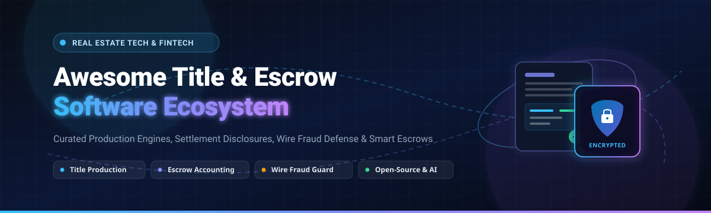

# 🏢 Awesome Title & Escrow Software 

  
  
  
  
  
  
  

  <strong>A curated list of battle-tested SaaS Platforms, PropTech APIs, and Open-Source Projects for Title Production, Escrow Accounting, Real Estate Closings, Settlement Statements (CD/HUD-1), Document Automation &amp; Wire Fraud Prevention.</strong>

  <em>Updated regularly for title agencies, settlement agents, closing attorneys, real estate escrow officers, and PropTech developers.</em>

---

## 📌 Table of Contents

- [🌟 Overview &amp; Industry Ecosystem](#-overview--industry-ecosystem)
- [🏢 SaaS / Hosted Title &amp; Escrow Platforms](#-saas--hosted-title--escrow-platforms)
- [💻 Open-Source GitHub Repositories](#-open-source-github-repositories)
- [🛠️ Open-Source Ecosystem &amp; Supporting Layers](#️-open-source-ecosystem--supporting-layers)
- [🤝 How to Contribute](#-how-to-contribute)
- [📈 Star History](#-star-history)
- [⚖️ Disclaimer &amp; Compliance](#️-disclaimer--compliance)

---

## 🌟 Overview & Industry Ecosystem

Title and escrow software systems serve as the core transactional backbone for residential and commercial real estate conveyancing. These mission-critical systems orchestrate:

- 🔍 **Title Search, Examination &amp; Commitment Generation**: Searching chain of title, examining deeds/liens/encumbrances, underwriting policy generation, and issuing ALTA Title Commitments.
- 💰 **Three-Way Escrow Accounting**: Regulated trust accounting, disbursement ledgering, earnest money deposit (EMD) verification, reconciliation, and 1099-S reporting.
- 📋 **Closing &amp; Settlement Management**: Preparing Closing Disclosures (TRID / CD), HUD-1 Settlement Statements, ALTA settlement sheets, and proration calculations.
- 🛡️ **Wire Fraud Defense &amp; Secure Closing Portals**: Multi-factor identity verification, secure wire instruction exchange, and automated bank account validation.
- ✍️ **Document Management, E-Signing &amp; E-Recording**: Remote Online Notarization (RON), electronic signatures, and county recorder e-recording integration.

---

## 🏢 SaaS / Hosted Title & Escrow Platforms

The table below catalogs leading commercial title production and escrow software suites, sorted in **descending order by company valuation / market size**.

| Platform | Company Size / Valuation | Core Capabilities &amp; Workflow Focus | Starting Pricing | Free Tier / Trial Limits |
| :--- | :--- | :--- | :--- | :--- |
| **[SoftPro](https://www.softprocorp.com/)** | 🏛️ Fortune 500 Parent **(~$14B+ Market Cap** / $12.5B+ Rev, NYSE: FNF) | Industry standard production platform featuring deep workflow automation, custom reporting, 3-way escrow reconciliation, and ALTA Best Practices compliance. | Starting at **$200/month** (SoftPro LIVE base tier for up to 50 orders + $4/additional order; desktop enterprise licenses start from ~$1,500/year per seat) | No free-forever plan; No self-serve free trial (offers interactive live demos and proof-of-concept upon request) |
| **[RamQuest](https://www.ramquest.com/)** | 🏛️ Fortune 500 Parent **(~$8.2B+ Market Cap** / $8.5B+ Rev, NYSE: ORI) | Comprehensive title production, escrow accounting, closing calendar, and PaperlessCloser customer collaboration portal. | Starting at **~$1,900/year** (~$158/month flat rate for base RamQuest One configurations) | No free-forever plan; No self-serve free trial (offers scheduled guided product demonstrations upon request) |
| **[Qualia](https://www.qualia.com/)** | 🦄 **$3.2B+ Valuation** (Series D Unicorn, ~$100M+ ARR) | Modern cloud-native title, escrow, and closing ecosystem with integrated lender portals, vendor marketplace, Qualia Connect, and Qualia Shield. | Starting at **~$3,599/year** (~$300/month for Qualia Core entry tier; add-ons for Connect/Shield billed separately) | No free-forever plan; No self-serve free trial (offers personalized 1-on-1 platform walkthrough demos upon request) |
| **[ResWare](https://www.resware.com/)** | 🏢 Part of **$3.2B+ Qualia** (Enterprise Production Division) | Highly configurable enterprise title and settlement workflow engine optimized for multi-state, high-volume operations and national underwriters. | Starting at **~$2,500/year** (enterprise base platform licensing; scales with order volume) | No free-forever plan; No self-serve free trial (offers customized enterprise demo walkthroughs upon request) |
| **[Lone Wolf Closing](https://www.lwolf.com/)** | 🦄 **$1.0B+ Valuation** (~$200M+ Rev, Stone Point / Vista Equity) | Closing, escrow management, and transaction coordination suite integrated within the broader Lone Wolf real estate software network. | Starting at **$179/year** (~$15/month for individual agent transaction tier; broker packages from ~$250/month) | No free-forever plan; 14-day free trial on select individual transaction/CRM tools (full feature access during 14-day trial period) |
| **[Closinglock](https://www.closinglock.com/)** | 🚀 **~$50M–$100M Valuation** (Series A/B Financed, $15M+ Raised) | Secure real estate closing and wire fraud defense portal providing encrypted wire instruction distribution, payoff verification, and e-signatures. | Starting at **~$150/month** (base agency subscription, or ~$45–$50 per transaction technology fee passing to closing files) | No free-forever plan; No self-serve free trial (offers free live fraud prevention demonstrations upon request) |
| **[Settlor](https://www.settlor.com/)** | 🚀 **~$40M–$80M Valuation** (Series A Venture Backed) | Next-generation cloud title and escrow management software engineered for agile title operations, document generation, and real-time party tracking. | Starting at **~$250/month** (starter agency tier for basic transaction volume; scales by file count) | No free-forever plan; No self-serve free trial (offers guided sandbox walkthroughs and live demos upon request) |
| **[AccuTitle](https://www.accutitle.com/)** | 📈 **~$30M–$50M Revenue** (PeakSpan Capital Growth Equity) | Title software ecosystem delivering streamlined production, title searches, underwriter integrations, and settlement operations. | Starting at **~$199/month** (or entry packages starting at $199 setup + $25/file for base production modules) | No free-forever plan; No self-serve free trial (offers live personalized product demos upon request) |
| **[TitleExpress](https://www.accutitle.com/)** | 📦 Part of **AccuTitle Suite** (~$30M–$50M Portfolio) | Modular title production and settlement management software designed for boutique title agencies, law firms, and independent closing attorneys. | Starting at **~$150/month** (~$1,800/year per user license for core title search and settlement modules) | No free-forever plan; No self-serve free trial (offers free guided software demonstrations upon request) |
| **[TitleFusion](https://www.accutitle.com/)** | 📦 Part of **AccuTitle Suite** (~$30M–$50M Portfolio) | Pure web-based title and settlement software supporting paperless closing workflows, automated commitments, and accounting ledgering. | Starting at **~$175/month** (base web-based title production and closing document generation tier) | No free-forever plan; No self-serve free trial (offers free live product demonstrations upon request) |

---

## 💻 Open-Source GitHub Repositories

Because commercial title production and escrow accounting carry strict regulatory, fiduciary, and legal underwriting liabilities, standalone open-source production platforms are rare. However, developers and legal engineering teams leverage these top open-source projects for document management, digital e-signatures, smart escrow contracts, legal form automation, and property data retrieval.

Repositories are listed in **descending order by GitHub star count**:

1. **[Paperless-ngx](https://github.com/paperless-ngx/paperless-ngx)**   
   📄 *Community-supported supercharged document management system.* Automatically scans, indexes, performs OCR, and archives title commitments, deeds, land records, settlement disclosures, and closing packages with full-text search.

2. **[DocuSeal](https://github.com/docusealco/docuseal)**   
   ✍️ *Open-source DocuSign alternative.* Create, fill, sign, and distribute digital real estate documents, closing disclosures, and buyer/seller signature packets securely.

3. **[OpenSign](https://github.com/OpenSignLabs/OpenSign)**   
   🔏 *Free &amp; open-source PDF e-signature platform.* Supports multi-party signing links, secure OTP guest authentication, signature verification, and audit trail generation for real estate closing packages.

4. **[Internet Court Agent Skill](https://github.com/internet-court/internet-court-skill)**   
   🤖 *Autonomous trust and smart escrow infrastructure.* Implements natural-language mandates, ERC-7710 delegated permissions, x402 payments, conditional escrow lockups, and dispute resolution mechanisms.

5. **[MicroRealEstate](https://github.com/microrealestate/microrealestate)**   
   🏢 *Open-source real estate and property management application.* Manages tenant leases, property listings, security deposit ledgers, rent schedules, and settlement tracking.

6. **[Docassemble](https://github.com/jhpyle/docassemble)**   
   📝 *Expert system for guided legal interviews and document assembly.* Powered by Python, YAML, and Markdown to automate complex real estate contracts, Closing Disclosures (CD), deeds, and closing forms.

7. **[HomeHarvest](https://github.com/ZacharyHampton/HomeHarvest)**   
   🏡 *Python library for scraping and aggregating real estate property data.* Facilitates automated property lookups, parcel history verification, and preliminary title due diligence.

8. **[Open-Transactions](https://github.com/FellowTraveler/Open-Transactions-old)**   
   💳 *Cryptographic financial transaction library.* Supports programmable smart contracts, digital cash, non-repudiable cheques, receipts, and multi-party trust-minimized escrow.

9. **[Solana Escrow Program](https://github.com/paul-schaaf/solana-escrow)**   
   ⚡ *High-performance smart contract escrow reference implementation.* Demonstrates atomic token, asset, and payment swaps on Solana with programmatic release conditions.

10. **[Solidity Escrow Arrangement](https://github.com/alejoacosta74/solidity-escrow-arrangement)**   
    🛡️ *ERC20-compliant escrow arrangement on Ethereum.* Implements multi-party escrow contracts designed for property transactions with arbiter dispute mechanisms.

11. **[Arc Escrow Sample](https://github.com/circlefin/arc-escrow)**   
    🔄 *End-to-end automated escrow workflow sample.* Demonstrates contract creation, deposit handling, AI-assisted deliverable verification, and disbursement or refund.

12. **[OpenEscrow](https://github.com/omslice/OpenEscrow)**   
    🔐 *Transparent trust-minimized escrow prototype.* Designed specifically for managing security deposit escrow accounts, deposit releases, and dispute mediation.

13. **[Decentral-Estate](https://github.com/shubh-p/Decentral-Estate)**   
    🌐 *Decentralized real estate dApp.* Enables direct property purchases via cryptocurrency wallets using property tokenization/NFTs and smart contract escrow.

14. **[Real Estate Escrow Hardhat](https://github.com/JuniorDCoder/real-estate-escrow)**   
    🏗️ *Full-stack decentralized real estate escrow system.* Built with Solidity, Hardhat, OpenZeppelin, and React to coordinate buyer, seller, lender, and inspector approvals.

15. **[Ethereum Real Estate Escrow](https://github.com/Veera93/real-estate-escrow)**   
    🧪 *Smart contract prototype for real estate earnest money escrow.* Holds earnest funds and releases them conditionally based on title clearance and inspection milestones.

---

## 🛠️ Open-Source Ecosystem & Supporting Layers

When architecting technology for title agencies and escrow operations, open-source building blocks excel in supporting layers:

- 📑 **Document Processing &amp; OCR**: Tools like `Paperless-ngx` automate indexing of closing binders, prior owner policies, and recorded surveys.
- 🖋️ **E-Signature Workflows**: Self-hosted solutions like `DocuSeal` and `OpenSign` allow agencies to securely execute closing acknowledgments and internal checkoffs.
- 🤖 **AI-Assisted Title Diligence**: LLMs and agent frameworks parse lengthy title search commitments, extracting exceptions, requirements, and municipal lien items.
- 🔐 **Escrow Security &amp; Smart Contracts**: Cryptographic escrow prototypes illustrate trust-minimized earnest money holding and rule-based disbursement mechanics.

> [!IMPORTANT]
> **Regulatory Notice**: Core title policy production and fiduciary escrow trust accounting require adherence to strict state insurance commissioner rules, ALTA Best Practices, and title underwriter approval. Always ensure production software complies with local real estate licensing and wire security protocols.

---

## 🤝 How to Contribute

We welcome contributions from the title, escrow, settlement, and PropTech communities!

1. 🍴 **Fork the repository**
2. 🌿 **Create a new branch**: `git checkout -b feature/add-title-tool`
3. 📝 **Add your entry**: Ensure you follow the tabular format for SaaS products (including specific starting pricing, company size/valuation, and free tier limits) or the badge-linked format for open-source repositories.
4. 🚀 **Submit a Pull Request** with a concise summary of the addition.

---

## 📈 Star History

---

## ⚖️ Disclaimer & Compliance

- This repository is a **community-curated index** for informational and educational purposes — inclusion does not constitute an endorsement.
- Real estate title examination, escrow trust accounting, and settlement closing statements involve state-regulated legal and financial procedures.
- Confirm that any chosen solution adheres to ALTA Best Practices Framework, SOC 2 Type II data security standards, and state-specific Department of Insurance / Bar Association guidelines before live closing usage.

---

  Curated with ❤️ by <a href="https://github.com/ishandutta2007">Ishan Dutta</a> and the PropTech &amp; Title/Escrow community.

